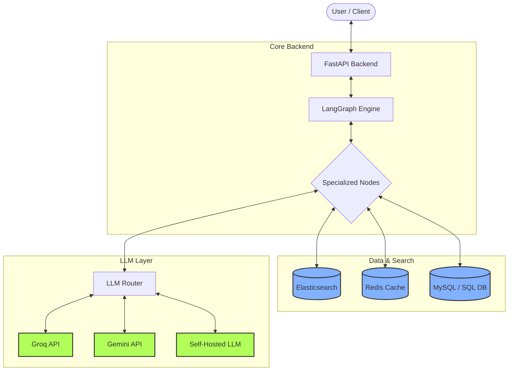
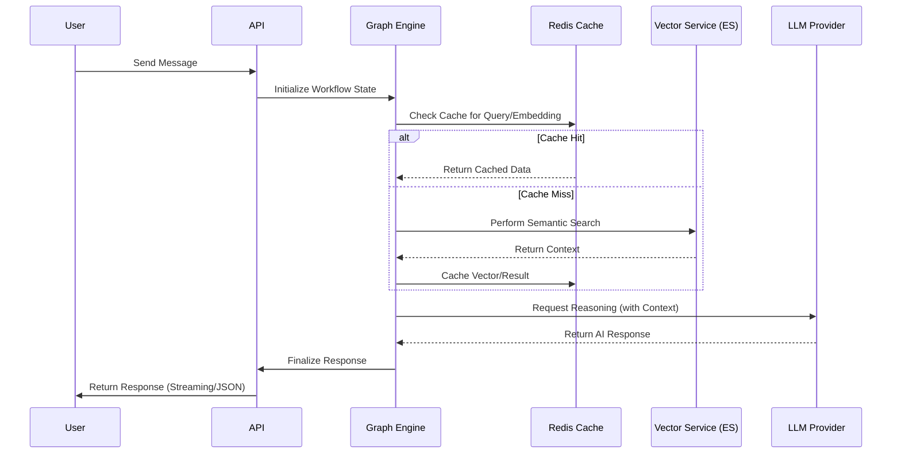

# ⚡ LightningBot (Optimized AI Backend)

A ultra-high-performance **FastAPI** backend designed for lighting-fast response times. This is an optimized version of the facility operations assistant, leveraging **Elasticsearch** for scalable vector search, **Redis** for aggressive caching, and **Bulk APIs** for high-throughput ingestion.

## 🏗️ Architecture

The backend is structured as a graph of specialized agents optimized for speed:
*   **Graph Engine**: Stateful, cyclical reasoning using `LangGraph`.
*   **Vector Search (ES)**: Uses **Elasticsearch** for production-grade, distributed vector search.
*   **Lightning Cache**: **Redis** caching for vectors and LLM responses, reducing latency by up to 80% on repeat queries.
*   **High-Speed Ingestion**: Optimized with Elasticsearch Bulk APIs.

## ✨ Lightning Features

- **Connection Pooling**: Optimized ES and Redis clients for high concurrency.
- **Selective Field Fetching**: Only retrieves required data from the database to minimize JSON overhead.
- **Batch Processing**: Parallelizes embedding generation for document ingestion.

## 🚀 Running with Docker (Lightning Mode)

The easiest way to find and run this system is using Docker Compose. The project is named **LightningBot** for easy identification.

```bash
# Start all services (Backend, ES, Redis, MySQL, Dashboard)
docker compose up -d

# Verify running containers
docker ps --filter name=lightning_
```

| Service | Container Name | Port |
| :--- | :--- | :--- |
| **Backend API** | `lightning_backend` | `8000` |
| **Elasticsearch** | `lightning_es` | `9201` |
| **Redis Cache** | `lightning_redis` | `6380` |
| **Dashboard** | `lightning_dashboard` | `8501` |

## 🏗️ System Architecture

The following diagram illustrates the core components of the **LightningBot** system and how they interact:



## 🔄 Request-Response Flow

This sequence diagram shows how a user query is processed through the multi-agent graph with caching and vector search:



## 📂 Project Structure
```
app/
├── api/        # FastAPI Routes
├── core/       # Optimized ES/Redis Clients
├── db/         # SQL Models
├── graph/      # Multi-Agent Logic
├── llm/        # Model Router (Groq/Gemini/Self-Hosted)
├── services/   # Lightning Vector Service 
└── workflow/   # Workflow Engine
```

## ❓ FAQ & Clarifications

### Why is there no local database?
The system is designed to use a managed/external **SQL Database** (MySQL/PostgreSQL) via the `DATABASE_URL` environment variable. This ensures data persistence and security are handled by a dedicated database provider.


