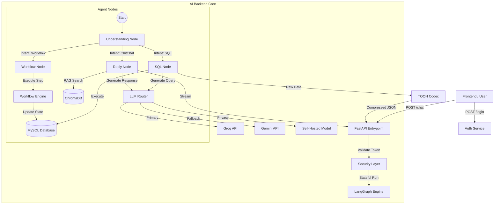

# Multi-Agent Facility Ops Assistant Backend

A production-ready **FastAPI** backend designed for high-performance facility operations. It leverages **LangGraph** for multi-agent reasoning, **ChromaDB** for semantic search, and **TOON** for optimized data transmission.

## 🏗️ Architecture

The backend is structured as a graph of specialized "agents" (nodes) that handle specific tasks:
*   **Graph Engine**: Built with `LangGraph` and `LangChain`, creating a stateful, cyclical reasoning loop.
*   **Database**: Async `SQLAlchemy` with MySQL/MariaDB for structured data.
*   **Vector Query**: `ChromaDB` for semantic document retrieval (long-term memory/search).
*   **Response Optimization**: Custom `TOON` (Token-Oriented Object Notation) codec to compress repetitive JSON responses by up to 70%.



## ✨ Key Features

### 1. Multi-Model Intelligence
*   **Router**: Dynamically selects the best LLM provider based on availability/latency.
*   **Hierarchy**: Groq (Llama3-70b) ➜ Gemini Flash ➜ Self-Hosted (Local).

### 2. Intelligent Agents
*   **Understanding Node**: Classifies intent (Chat vs. Workflow vs. SQL).
*   **SQL Node**: Generates safe, schema-aware `SELECT` queries to answer data questions.
*   **Workflow Node**: Executes predefined maintenance workflows (e.g., "Schedule Inspection").

### 3. Advanced Data Handling
*   **Vector Search**: Integrated **ChromaDB** (`app/vector/store.py`) allows semantic search over documents and logs.
    *   *Endpoint*: `POST /vector/demo`
*   **TOON Compression**: Real-time reference-based compression (`app/toon/codec.py`) for large table responses, significantly reducing detailed payload size.

## 🚀 Installation & Setup

### 1. Prerequisites
*   Python 3.10+
*   MySQL Server (or compatible)

### 2. Setup
```bash
# Clone the repository
git clone <repo-url>
cd backend

# Create Virtual Environment
python -m venv venv
source venv/bin/activate  # Linux/Mac
# venv\Scripts\activate   # Windows

# Install Dependencies
pip install -r requirements.txt
```

### 3. Environment Variables
Copy `.env.example` to `.env` and configure:
```bash
cp .env.example .env
# Edit .env with your LLM API keys (GROQ_API_KEY, GOOGLE_API_KEY) and DB credentials.
```

## 🏃 Running the Server

Start the development server with hot-reload:
```bash
uvicorn app.api.main:app --reload
```
The API serves at `http://localhost:8000`.

## 🧪 Verification

### Health Check
```bash
curl http://localhost:8000/health
```

### Verify Vector DB
```bash
curl -X POST "http://localhost:8000/vector/demo?text=Test%20Document&query=Test"
```

### Run Full Verification Script
```bash
python verify_backend.py
```

## 📂 Project Structure
```
app/
├── api/        # FastAPI Routes & Schemas
├── core/       # Config, Logging, Security
├── db/         # SQL Models & Session
├── graph/      # LangGraph Nodes & Edges
├── llm/        # Model Providers (Groq, Gemini)
├── toon/       # TOON Compression Codec
├── vector/     # ChromaDB Vector Store
└── workflow/   # YAML-driven Workflows
```

## 📚 Documentation
- [Frontend Integration Guide](docs/frontend_guide.md)
- [Technical Flow](docs/TECHNICAL_FLOW.md)
