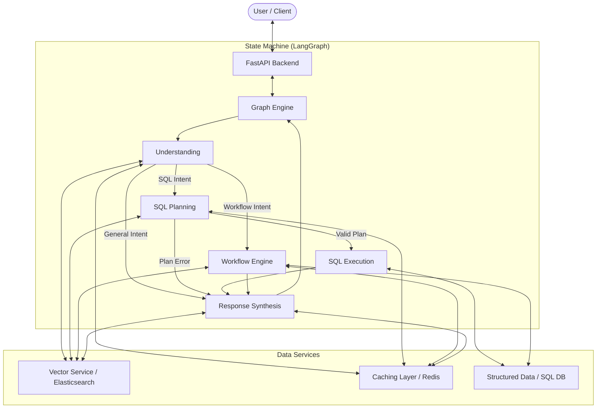

# LightningBot (Optimized AI Backend)

LightningBot is a high-performance FastAPI backend designed for low-latency AI-driven operations. This implementation optimizes the facility operations assistant by utilizing Elasticsearch for distributed vector search, Redis for hierarchical caching, and a multi-agent state graph for complex reasoning.

## Architecture Overview

The system architecture is centered around a state-driven graph engine that orchestrates specialized agents and services.

### Core Backend Implementation

The backend logic is implemented as a state machine using the LangGraph engine. Every request traverses a series of nodes that incrementally process the user input:

1.  **Intent Understanding Node**: Analyzes the raw prompt to determine whether it requires a database query (SQL), a multi-step process (Workflow), or a direct response (General Chat).
2.  **SQL Planning Node**: For database-centric intents, this node translates natural language into optimized SQL queries after analyzing the target schema.
3.  **SQL Execution Node**: Safely executes the generated SQL and formats the results for subsequent reasoning.
4.  **Workflow Engine Node**: Handles stateful interactions for complex tasks, such as creating schedules or updating facility metadata.
5.  **Response Synthesis Node**: Aggregates context from the vector database, SQL results, and workflow status to generate a final consolidated response.



### Data Layer and Search

- **Vector Search**: Utilizes Elasticsearch for dense vector indexing and retrieval, supporting production-grade scalability.
- **Hierarchical Caching**: Implements Redis to cache both vector embeddings and LLM response fragments, reducing average latency significantly.
- **Service Layer**: Centralized business logic in `app/services/` for handling vector operations, usage metrics, and historical context.

### LLM Integration Layer

The system serves as a model-agnostic router. Connectivity is managed via environment-specified URLs for various providers:

- **Self-Hosted / Private Cloud**: Configurable via `SELF_HOSTED_BASE_URL` (supports Qwen, Llama, etc.).
- **Cloud Providers**: Native support for Groq and AWS Bedrock via standardized API endpoints.

## Project Structure

```
app/
├── api/        # FastAPI Endpoint Definitions
├── core/       # Optimized Infrastructure Clients (ES, Redis)
├── db/         # SQL Alchemy Models and Sessions
├── graph/      # Multi-Agent State Machine Logic
├── llm/        # Model Provider Router
├── services/   # Centralized Vector and Metadata Services
└── workflow/   # Stateful Interaction flows
```

## Deployment Configuration

The application is containerized for consistent deployment across environments.

```bash
# Start infrastructure and application services
docker compose up -d

# Verify service health
docker ps --filter name=lightning_
```

| Service | Container Name | Interface Port |
| :--- | :--- | :--- |
| **Backend API** | `lightning_backend` | `8000` |
| **Elasticsearch** | `lightning_es` | `9201` |
| **Redis Cache** | `lightning_redis` | `6380` |
| **Dashboard** | `lightning_dashboard` | `8501` |

## Frequently Asked Questions

### Why is there no local database service in the configuration?
The system is designed to interface with managed SQL databases via the `DATABASE_URL` environment variable. This approach ensures that data persistence and security are handled by enterprise-grade infrastructure.

### How is the LLM provider selected?
The backend uses a routing mechanism defined in `app/llm/router.py`. It prioritizes providers based on the `LLM_PRIMARY_PROVIDER` setting, allowing for seamless transitions between local models and third-party APIs.
