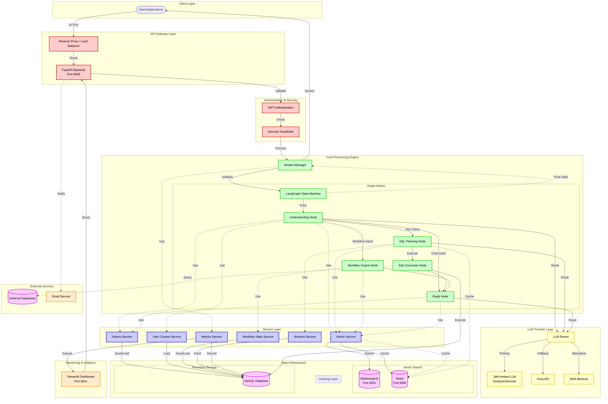
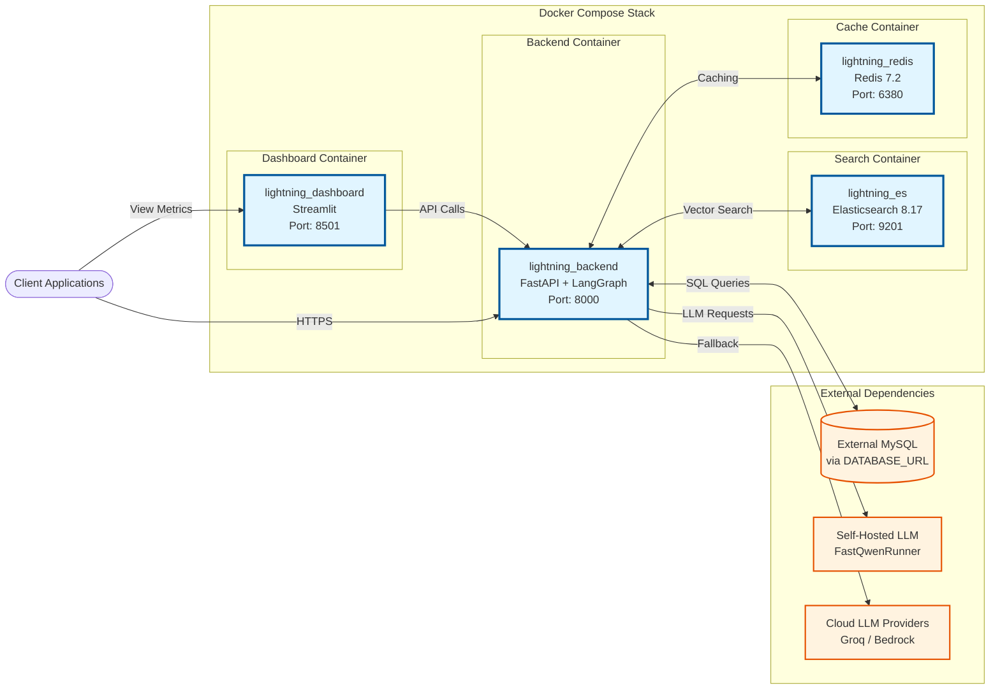
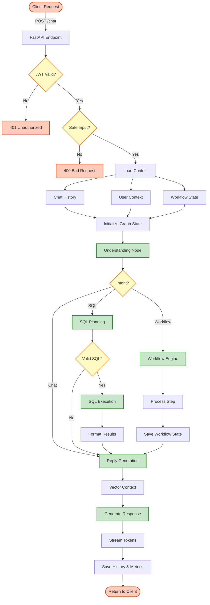
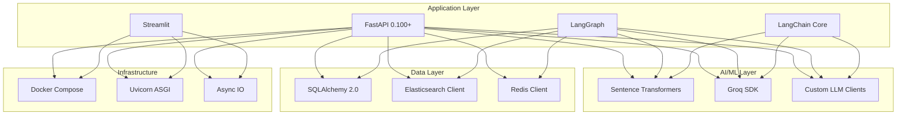

# LightningBot - System Architecture Diagram

## Complete System Architecture

## Container Deployment View

## Request Processing Flow

## Data Flow Architecture

```mermaid
graph LR
    subgraph "Input Layer"
        I1[User Message] --> I2[Security Check]
        I2 --> I3[Load History]
        I3 --> I4[Load Context]
    end
    
    subgraph "Processing Layer"
        I4 --> P1[Intent Classification]
        P1 --> P2{Route}
        
        P2 -->|SQL| S1[Schema Fetch]
        S1 --> S2[SQL Generation]
        S2 --> S3[SQL Execution]
        S3 --> S4[Result Format]
        
        P2 -->|Workflow| W1[Load State]
        W1 --> W2[Process Step]
        W2 --> W3[Save State]
        
        P2 -->|Chat| C1[Vector Search]
        C1 --> C2[Context Retrieval]
    end
    
    subgraph "Response Layer"
        S4 --> R1[Aggregate Context]
        W3 --> R1
        C2 --> R1
        
        R1 --> R2[Generate Response]
        R2 --> R3[Stream Output]
    end
    
    subgraph "Persistence Layer"
        R3 --> D1[Save History]
        R3 --> D2[Save Workflow]
        R3 --> D3[Save Metrics]
    end
    
    D1 & D2 & D3 --> Output[Client Response]
    
    classDef input fill:#e3f2fd,stroke:#1565c0,stroke-width:2px;
    classDef process fill:#f3e5f5,stroke:#6a1b9a,stroke-width:2px;
    classDef response fill:#e8f5e9,stroke:#2e7d32,stroke-width:2px;
    classDef persist fill:#fff3e0,stroke:#ef6c00,stroke-width:2px;
    
    class I1,I2,I3,I4 input;
    class P1,P2,S1,S2,S3,S4,W1,W2,W3,C1,C2 process;
    class R1,R2,R3 response;
    class D1,D2,D3,Output persist;
```

## Component Interaction Matrix

| Component | Elasticsearch | Redis | MySQL | LLM Router | Vector Service | History Service |
|-----------|--------------|-------|-------|------------|----------------|-----------------|
| **Understanding Node** | ✓ (via Vector) | ✓ (cache) | ✓ (context) | ✓ | ✓ | ✓ |
| **SQL Planning Node** | - | ✓ (cache) | ✓ (schema) | ✓ | - | - |
| **SQL Execution Node** | - | - | ✓ (execute) | - | - | - |
| **Workflow Engine** | - | - | ✓ (state) | ✓ | - | - |
| **Reply Node** | ✓ (via Vector) | ✓ (cache) | - | ✓ | ✓ | - |
| **Stream Manager** | - | - | ✓ (save) | - | - | ✓ |

## Technology Stack

## Key Features

### Performance Optimizations
- **Redis Caching**: Multi-level caching for embeddings, SQL queries, and LLM responses
- **Elasticsearch Bulk API**: High-throughput document indexing
- **Connection Pooling**: Optimized database and cache connections
- **Async Processing**: Non-blocking I/O for all external calls

### Reliability Features
- **LLM Fallback Chain**: Primary → Fallback → Production provider routing
- **Health Checks**: Provider availability monitoring
- **Error Handling**: Graceful degradation and error recovery
- **State Persistence**: Workflow state recovery across sessions

### Security Measures
- **JWT Authentication**: Token-based user authentication
- **Input Guardrails**: Malicious content detection and blocking
- **SQL Injection Prevention**: Parameterized queries and validation
- **CORS Configuration**: Controlled cross-origin access
