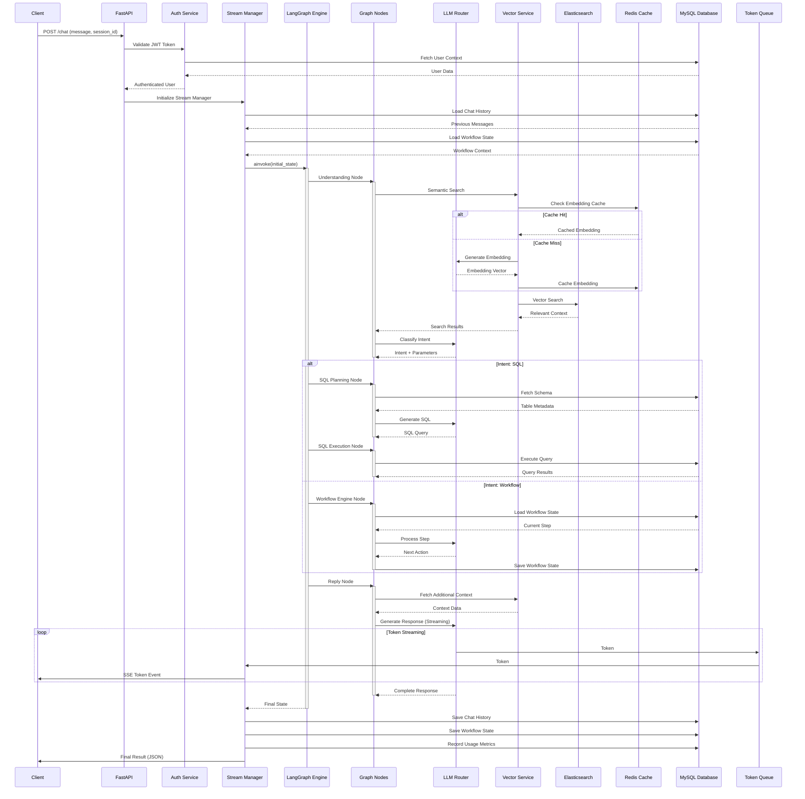

# LightningBot - Complete System Architecture

This document provides a comprehensive architectural overview of the LightningBot system, covering all implementation details from the API layer to data persistence.

## Complete System Architecture

```mermaid
graph TB
    subgraph "Client Layer"
        Client[Client Application]
    end
    
    subgraph "API Gateway"
        Client -->|HTTP/WebSocket| FastAPI[FastAPI Application]
        FastAPI -->|CORS & Auth| Middleware[Middleware Layer]
        Middleware -->|Trace ID| TraceManager[Trace Manager]
    end
    
    subgraph "Authentication & Authorization"
        Middleware --> Auth[Auth Service]
        Auth -->|JWT Validation| TokenVerify[Token Verification]
        TokenVerify -->|User Context| UserDB[(User Table)]
    end
    
    subgraph "Request Processing Pipeline"
        Middleware --> StreamManager[Chat Stream Manager]
        StreamManager -->|Initialize State| GraphEngine[LangGraph Engine]
        StreamManager -->|Token Queue| StreamQueue[Async Queue]
    end
    
    subgraph "LangGraph State Machine"
        GraphEngine -->|Entry Point| Understanding[Understanding Node]
        
        Understanding -->|Intent: SQL| SQLPlanning[SQL Planning Node]
        Understanding -->|Intent: Workflow| WorkflowEngine[Workflow Engine Node]
        Understanding -->|Intent: Chat| Reply[Reply Node]
        
        SQLPlanning -->|Valid Query| SQLExecution[SQL Execution Node]
        SQLPlanning -->|Invalid/Error| Reply
        
        SQLExecution --> Reply
        WorkflowEngine --> Reply
        
        Reply -->|Final Response| GraphEngine
    end
    
    subgraph "Understanding Node Details"
        Understanding --> IntentClassifier[Intent Classifier]
        IntentClassifier -->|Analyze Prompt| LLMRouter1[LLM Router]
        IntentClassifier -->|Check History| HistoryService[History Service]
        IntentClassifier -->|Load Context| UserContextService[User Context Service]
        IntentClassifier -->|Semantic Search| VectorService1[Vector Service]
    end
    
    subgraph "SQL Planning Node Details"
        SQLPlanning --> SchemaAnalyzer[Schema Analyzer]
        SchemaAnalyzer -->|Fetch Schema| SchemaService[Schema Service]
        SchemaAnalyzer -->|Check Cache| SQLCache[(SQL Cache Table)]
        SchemaAnalyzer -->|Generate SQL| LLMRouter2[LLM Router]
        SchemaAnalyzer -->|Validate| SQLValidator[SQL Validator]
    end
    
    subgraph "SQL Execution Node Details"
        SQLExecution --> SafeExecutor[Safe SQL Executor]
        SafeExecutor -->|Execute Query| TargetDB[(Target Database)]
        SafeExecutor -->|Format Results| ResultFormatter[Result Formatter]
        ResultFormatter -->|Encode| ToonCodec[TOON Codec]
    end
    
    subgraph "Workflow Engine Details"
        WorkflowEngine --> WorkflowRegistry[Workflow Registry]
        WorkflowRegistry -->|Scheduler| SchedulerFlow[Scheduler Workflow]
        WorkflowRegistry -->|Task Update| TaskUpdateFlow[Task Update Workflow]
        WorkflowRegistry -->|Help Menu| HelpFlow[Help Workflow]
        
        SchedulerFlow -->|Load State| WorkflowStateService[Workflow State Service]
        SchedulerFlow -->|Multi-Step| StepProcessor[Step Processor]
        StepProcessor -->|Save State| WorkflowStateDB[(Workflow State Table)]
    end
    
    subgraph "Reply Node Details"
        Reply --> ResponseBuilder[Response Builder]
        ResponseBuilder -->|Context Assembly| ContextAggregator[Context Aggregator]
        ContextAggregator -->|Vector Context| VectorService2[Vector Service]
        ContextAggregator -->|SQL Results| SQLResults[SQL Results]
        ContextAggregator -->|Workflow Data| WorkflowData[Workflow Data]
        ResponseBuilder -->|Generate| LLMRouter3[LLM Router]
        ResponseBuilder -->|Stream Tokens| StreamQueue
    end
    
    subgraph "LLM Provider Layer"
        LLMRouter1 & LLMRouter2 & LLMRouter3 --> ProviderRouter[LLM Provider Router]
        ProviderRouter -->|Primary| SelfHosted[Self-Hosted LLM]
        ProviderRouter -->|Fallback| Groq[Groq API]
        ProviderRouter -->|Alternative| Bedrock[AWS Bedrock]
        
        SelfHosted -->|HTTP| SelfHostedURL[SELF_HOSTED_BASE_URL]
        Groq -->|HTTP| GroqURL[GROQ_BASE_URL]
        Bedrock -->|HTTP| BedrockURL[BEDROCK_BASE_URL]
    end
    
    subgraph "Vector Search Infrastructure"
        VectorService1 & VectorService2 --> VectorCore[Vector Service Core]
        VectorCore -->|Generate Embeddings| EmbeddingModel[Embedding Model]
        VectorCore -->|Check Cache| RedisCache1[Redis Cache]
        VectorCore -->|Vector Search| Elasticsearch[(Elasticsearch)]
        VectorCore -->|Bulk Index| ESBulkAPI[ES Bulk API]
    end
    
    subgraph "Data Persistence Layer"
        HistoryService -->|Save Messages| ChatHistoryDB[(Chat History Table)]
        WorkflowStateService -->|Save/Load State| WorkflowStateDB
        UserContextService -->|Load User Data| UserDB
        SchemaService -->|Fetch Metadata| SchemaDB[(Schema Table)]
        
        ChatHistoryDB & WorkflowStateDB & UserDB & SchemaDB & SQLCache --> MySQL[(MySQL Database)]
    end
    
    subgraph "Caching Layer"
        RedisCache1[Redis Cache] --> RedisClient[Redis Client]
        RedisClient -->|Embedding Cache| EmbedCache[Embedding Cache]
        RedisClient -->|Response Cache| ResponseCache[Response Cache]
        RedisClient -->|Connection Pool| RedisPool[Connection Pool]
    end
    
    subgraph "Monitoring & Metrics"
        StreamManager -->|Record Metrics| MetricsService[Metrics Service]
        MetricsService -->|Usage Data| MetricsDB[(Usage Metrics Table)]
        MetricsDB --> MySQL
        
        MetricsService -->|Analytics| Dashboard[Streamlit Dashboard]
        Dashboard -->|Query API| FastAPI
    end
    
    subgraph "Security & Guardrails"
        Middleware -->|Input Validation| Guardrails[Guardrails Service]
        Guardrails -->|Safety Check| SafetyRules[Security Rules]
        Guardrails -->|Block Malicious| BlockList[Block List]
    end
    
    subgraph "Infrastructure Services"
        Elasticsearch -->|Index Management| ESClient[ES Client]
        RedisClient -->|Connection| RedisInfra[Redis Infrastructure]
        MySQL -->|Connection Pool| SQLAlchemy[SQLAlchemy Engine]
    end
    
    GraphEngine -.->|Final State| StreamManager
    StreamManager -->|Save History| HistoryService
    StreamManager -->|Save Workflow| WorkflowStateService
    StreamManager -->|Format Response| ResponseFormatter2[Response Formatter]
    ResponseFormatter2 -->|JSON Stream| Client
    
    classDef nodeClass fill:#e1f5ff,stroke:#01579b,stroke-width:2px;
    classDef serviceClass fill:#f3e5f5,stroke:#4a148c,stroke-width:2px;
    classDef dbClass fill:#fff3e0,stroke:#e65100,stroke-width:2px;
    classDef infraClass fill:#e8f5e9,stroke:#1b5e20,stroke-width:2px;
    classDef llmClass fill:#fce4ec,stroke:#880e4f,stroke-width:2px;
    
    class Understanding,SQLPlanning,SQLExecution,WorkflowEngine,Reply nodeClass;
    class HistoryService,UserContextService,VectorService1,VectorService2,MetricsService,WorkflowStateService,SchemaService serviceClass;
    class MySQL,Elasticsearch,UserDB,ChatHistoryDB,WorkflowStateDB,MetricsDB,SchemaDB,SQLCache,TargetDB dbClass;
    class RedisClient,ESClient,SQLAlchemy,RedisInfra infraClass;
    class SelfHosted,Groq,Bedrock,ProviderRouter,LLMRouter1,LLMRouter2,LLMRouter3 llmClass;
```

## Request Flow Sequence

## Data Flow Architecture

```mermaid
graph LR
    subgraph "Input Processing"
        Input[User Input] --> Guardrails[Security Validation]
        Guardrails --> History[Load History]
        History --> Context[Load User Context]
    end
    
    subgraph "Intent Classification"
        Context --> Vector1[Vector Search]
        Vector1 --> LLM1[LLM Classification]
        LLM1 --> Intent{Intent Type}
    end
    
    subgraph "SQL Path"
        Intent -->|SQL| Schema[Schema Fetch]
        Schema --> SQLGen[SQL Generation]
        SQLGen --> SQLExec[SQL Execution]
        SQLExec --> SQLFormat[Result Formatting]
        SQLFormat --> TOON[TOON Encoding]
    end
    
    subgraph "Workflow Path"
        Intent -->|Workflow| WFLoad[Load Workflow State]
        WFLoad --> WFProcess[Process Step]
        WFProcess --> WFSave[Save State]
    end
    
    subgraph "Chat Path"
        Intent -->|Chat| Vector2[Vector Context]
        Vector2 --> ChatGen[Response Generation]
    end
    
    subgraph "Response Assembly"
        TOON --> Aggregate[Context Aggregation]
        WFSave --> Aggregate
        ChatGen --> Aggregate
        Aggregate --> FinalLLM[Final Response LLM]
        FinalLLM --> Stream[Token Streaming]
    end
    
    subgraph "Persistence"
        Stream --> SaveHistory[Save History]
        Stream --> SaveWF[Save Workflow]
        Stream --> SaveMetrics[Save Metrics]
    end
    
    Stream --> Output[Client Response]
```

## Component Responsibilities

### Core Nodes
- **Understanding Node**: Intent classification, parameter extraction, context loading
- **SQL Planning Node**: Schema analysis, SQL generation, query validation, caching
- **SQL Execution Node**: Safe query execution, result formatting, TOON encoding
- **Workflow Engine Node**: Multi-step process orchestration, state management
- **Reply Node**: Context aggregation, response synthesis, token streaming

### Service Layer
- **Vector Service**: Embedding generation, semantic search, bulk indexing
- **History Service**: Chat history persistence and retrieval
- **User Context Service**: User metadata and company context loading
- **Workflow State Service**: Workflow state persistence and recovery
- **Metrics Service**: Usage tracking and analytics aggregation
- **Schema Service**: Database schema metadata management

### Infrastructure
- **Elasticsearch**: Vector storage, semantic search, distributed indexing
- **Redis**: Multi-level caching (embeddings, responses, SQL queries)
- **MySQL**: Structured data persistence (users, history, workflows, metrics)
- **LLM Router**: Provider abstraction, fallback handling, model selection

### Security & Quality
- **Guardrails Service**: Input validation, safety checks, malicious content blocking
- **TOON Codec**: Efficient data encoding for large result sets
- **Trace Manager**: Request tracking and observability
